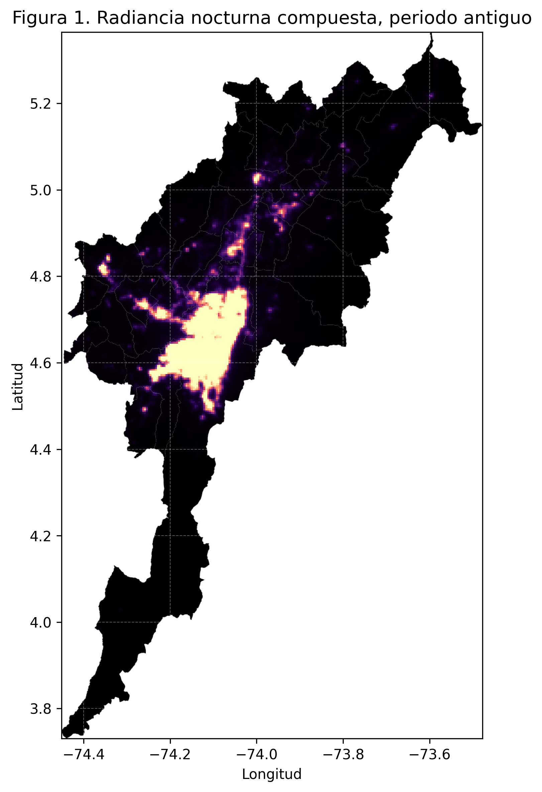
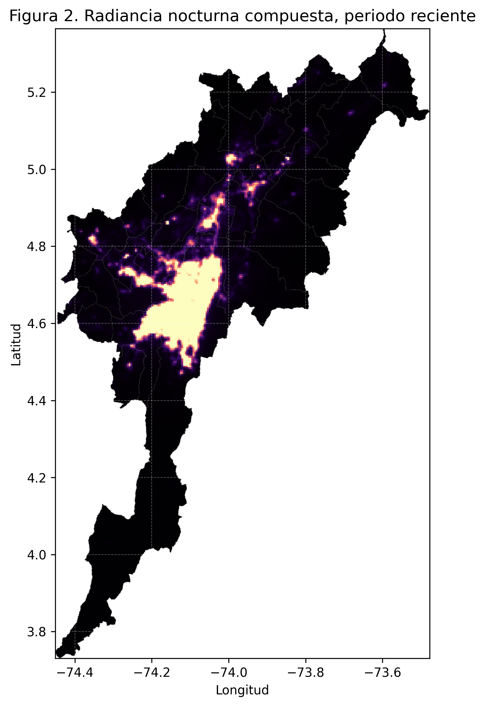
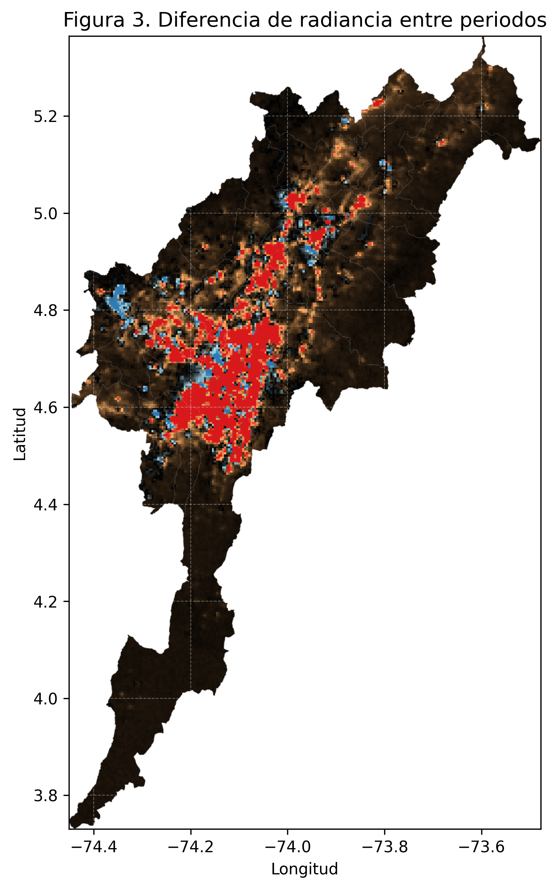
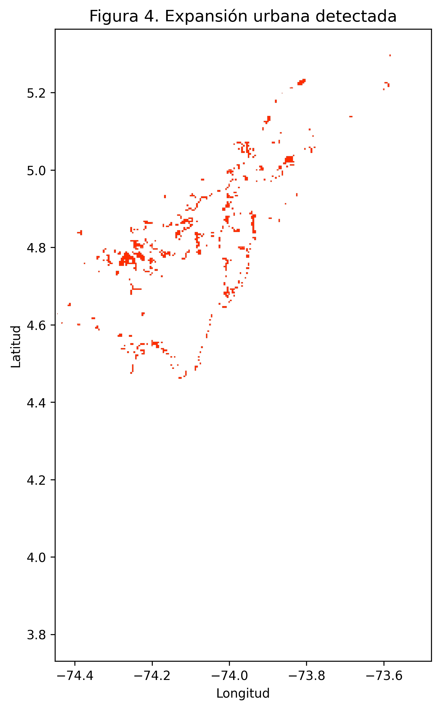

# Introducción

La expansión urbana constituye uno de los procesos territoriales más evidentes en la Sabana de Bogotá durante las últimas décadas. Su seguimiento mediante sensores remotos permite aproximarse a la dinámica de consolidación del núcleo metropolitano, al crecimiento periférico y a la intensificación de corredores suburbanos. En este ejercicio se aborda el reto de *cuantificación de expansión urbana* planteado en el módulo, sustituyendo el uso de datos históricos DMSP-OLS por la colección VIIRS, cuya resolución radiométrica mejora la capacidad de detectar cambios en la intensidad lumínica y reduce los problemas de saturación presentes en sensores anteriores.

El análisis se basa en el supuesto de que la radiancia nocturna actúa como un proxy razonable de urbanización, infraestructura y actividad humana. A partir de compuestos multianuales de la banda `avg_rad`, se comparan dos periodos temporales en la Sabana de Bogotá para identificar píxeles que pasaron de una condición no urbana a una urbana bajo un criterio de umbralización calibrado empíricamente.

# Objetivo

Cuantificar la expansión urbana detectada mediante radiancia nocturna VIIRS en la Sabana de Bogotá a partir de la comparación entre un periodo antiguo (2014--2016) y un periodo reciente (2022--2024).

# Fundamentos conceptuales requeridos

## Arquitectura cliente-servidor en Google Earth Engine

Google Earth Engine (GEE) opera bajo una arquitectura distribuida en la cual el usuario interactúa desde un entorno local (cliente), mientras que el procesamiento geoespacial se ejecuta en la infraestructura de nube de Google (servidor). Esta separación permite manipular catálogos masivos de imágenes satelitales sin necesidad de descargarlos al computador personal.

Los objetos definidos mediante la API de Earth Engine, como `ee.Image`, `ee.ImageCollection`, `ee.Geometry`, `ee.Number` o `ee.FeatureCollection`, no contienen inmediatamente los datos en memoria local. En realidad, representan instrucciones o grafos computacionales que serán evaluados posteriormente en el servidor. Por esta razón, variables nativas de Python o JavaScript, como listas estándar, diccionarios convencionales o números simples, no pueden reemplazar directamente dichos objetos cuando se requieren métodos espaciales como `.filterBounds()`, `.reduceRegion()` o `.map()`.

Por ejemplo, una lista de coordenadas escrita como `[lon, lat]` no equivale a una geometría espacial utilizable por GEE. Para ello se requiere una estructura explícita como `ee.Geometry.Point([lon, lat])`. Del mismo modo, un diccionario de Python no puede comportarse como una colección vectorial sin ser convertido previamente a una estructura del servidor.

El método `.getInfo()` cumple una función analítica estricta: fuerza la evaluación del objeto remoto y transfiere el resultado al entorno local. Esto permite recuperar valores numéricos, metadatos o estructuras tabulares para inspección directa. Sin embargo, su uso excesivo no es recomendable, ya que rompe la lógica de procesamiento distribuido y puede ralentizar el flujo de trabajo.

En el presente ejercicio, los compuestos temporales VIIRS, las operaciones de umbralización y la detección de expansión urbana fueron ejecutados en el servidor, mientras que los resultados finales fueron consultados localmente mediante `.getInfo()` para generar métricas y salidas cartográficas.

---

## Firmas espectrales y comportamiento radiométrico

La resolución espectral corresponde al número, posición y ancho de las bandas electromagnéticas registradas por un sensor remoto. Su importancia radica en que diferentes coberturas terrestres responden de forma distinta a la radiación incidente, lo que permite discriminarlas cuantitativamente.

En el caso de un cuerpo de agua como el Embalse de Tominé, la reflectancia suele ser baja en el espectro visible y extremadamente baja en el infrarrojo cercano (NIR) y en el infrarrojo de onda corta (SWIR). Esto ocurre porque el agua absorbe fuertemente la energía en esas longitudes de onda, razón por la cual suele aparecer oscura en composiciones falso color e índices espectrales.

Por el contrario, un parche de bosque altoandino presenta un comportamiento radiométrico opuesto. En la región roja del visible existe absorción significativa por clorofila, mientras que en el NIR la reflectancia aumenta de manera abrupta debido a la estructura interna de las hojas, especialmente el mesófilo esponjoso. En bandas SWIR la señal disminuye nuevamente por absorción asociada al contenido hídrico de la vegetación.

Esta diferencia entre agua y vegetación constituye una huella espectral claramente distinguible. Gracias a ello es posible construir índices como NDVI o NDWI, así como clasificaciones supervisadas y no supervisadas orientadas a cartografiar cuerpos de agua, bosques, humedales o coberturas urbanas.

Aunque el presente trabajo utilizó datos nocturnos VIIRS para analizar expansión urbana, el principio general es el mismo: la clasificación automatizada depende de contrastes medibles en la respuesta radiométrica registrada por el sensor.

# Metodología

## Área de estudio

El área de estudio corresponde a la Sabana de Bogotá, cargada desde un archivo vectorial en formato JSON (`sabog.json`). La geometría se utilizó como máscara espacial para recortar los compuestos VIIRS y para restringir los cálculos de área exclusivamente al dominio de análisis.

## Datos utilizados

Se empleó la colección mensual de luces nocturnas:

- `NOAA/VIIRS/DNB/MONTHLY_V1/VCMSLCFG`
- Banda analizada: `avg_rad`

Esta colección permite construir compuestos temporales estables a partir de la mediana de radiancia, reduciendo la influencia de luces transitorias, ruido y anomalías episódicas.

## Estrategia analítica

La metodología se estructuró en cinco pasos. Primero, se cargó la geometría de la Sabana de Bogotá y se inicializó la sesión de Google Earth Engine en Python. Segundo, se construyeron dos compuestos multianuales de radiancia nocturna: uno para 2014--2016 y otro para 2022--2024. Tercero, se aplicó un umbral binario a ambos compuestos para distinguir píxeles urbanos y no urbanos. Cuarto, se aisló la expansión urbana mediante álgebra de mapas, reteniendo únicamente los píxeles clasificados como urbanos en el periodo reciente pero no en el antiguo. Finalmente, se cuantificó el área resultante mediante `ee.Image.pixelArea()`.

Se evaluaron varios umbrales de radiancia. Un valor de 3 resultó demasiado sensible y produjo sobre-detección en áreas de baja intensidad; valores más altos redujeron en exceso la detección de crecimiento reciente. Por inspección visual y coherencia espacial del resultado, se adoptó un umbral de 4 como compromiso analítico.

## Código del flujo de trabajo

### Carga de librerías e inicialización

```{python}
import ee
import json
import pandas as pd

ee.Initialize()
print("Google Earth Engine inicializado correctamente")
```

### Carga del área de estudio

```{python}
with open("sabog.json", "r", encoding="utf-8") as f:
    sabog = json.load(f)

if sabog["type"] == "FeatureCollection":
    aoi_fc = ee.FeatureCollection(sabog)
    aoi = aoi_fc.geometry()
elif sabog["type"] == "Feature":
    aoi_fc = ee.FeatureCollection([sabog])
    aoi = ee.Feature(sabog).geometry()
elif sabog["type"] in ["Polygon", "MultiPolygon"]:
    aoi = ee.Geometry(sabog)
    aoi_fc = ee.FeatureCollection([ee.Feature(aoi)])
else:
    raise ValueError(f"Tipo de objeto JSON no soportado: {sabog['type']}")

print("Área de estudio cargada correctamente")
```

### Construcción de compuestos VIIRS

```{python}
viirs = ee.ImageCollection("NOAA/VIIRS/DNB/MONTHLY_V1/VCMSLCFG")

periodo_antiguo = (
    viirs
    .filterBounds(aoi)
    .filterDate("2014-01-01", "2016-12-31")
    .select("avg_rad")
    .median()
    .clip(aoi)
)

periodo_reciente = (
    viirs
    .filterBounds(aoi)
    .filterDate("2022-01-01", "2024-12-31")
    .select("avg_rad")
    .median()
    .clip(aoi)
)

print("Compuestos temporales creados")
```

### Umbralización y detección de expansión

```{python}
umbral = 4

urbano_antiguo = periodo_antiguo.gt(umbral)
urbano_reciente = periodo_reciente.gt(umbral)

expansion = urbano_reciente.And(urbano_antiguo.Not()).selfMask()

dif_rad = periodo_reciente.subtract(periodo_antiguo)

print("Mapa de expansión calculado")
```

### Cuantificación del área de expansión

```{python}
area_img = ee.Image.pixelArea().rename("area").updateMask(expansion)

res = area_img.reduceRegion(
    reducer=ee.Reducer.sum(),
    geometry=aoi,
    scale=463,
    maxPixels=1e13
)

area_m2 = res.get("area").getInfo() or 0
area_ha = area_m2 / 10000
area_km2 = area_m2 / 1e6

resumen = pd.DataFrame([
    {"Métrica": "Periodo antiguo", "Valor": "2014-2016"},
    {"Métrica": "Periodo reciente", "Valor": "2022-2024"},
    {"Métrica": "Umbral urbano", "Valor": umbral},
    {"Métrica": "Área de expansión (m²)", "Valor": area_m2},
    {"Métrica": "Área de expansión (ha)", "Valor": area_ha},
    {"Métrica": "Área de expansión (km²)", "Valor": area_km2},
])

resumen
```

# Resultados

## Radiancia nocturna compuesta del periodo antiguo

La Figura 1 muestra el compuesto de radiancia nocturna para 2014--2016. El patrón espacial se concentra de forma dominante en el núcleo urbano de Bogotá, con continuidad hacia los corredores occidentales y hacia el eje norte de la Sabana. En este periodo ya se observa una estructura metropolitana consolidada, especialmente en la franja central del área de estudio.

{fig-cap="Radiancia nocturna compuesta para el periodo 2014--2016 en la Sabana de Bogotá." fig-pos="H"}

## Radiancia nocturna compuesta del periodo reciente

La Figura 2 presenta el compuesto correspondiente a 2022--2024. La configuración general se mantiene, pero se aprecia mayor continuidad de focos luminosos en corredores periféricos y una intensificación de la conectividad entre el núcleo bogotano y sectores suburbanos. Esto sugiere consolidación urbana adicional y crecimiento de la infraestructura asociada.

{fig-cap="Radiancia nocturna compuesta para el periodo 2022--2024 en la Sabana de Bogotá." fig-pos="H"}

## Diferencia de radiancia entre periodos

La Figura 3 representa la diferencia de radiancia entre ambos compuestos. Los incrementos aparecen en tonos cálidos, mientras que las disminuciones aparecen en tonos fríos. El resultado muestra que el aumento de radiancia se concentra en bordes urbanos, corredores intermunicipales y focos dispersos del norte y occidente de la Sabana. La señal no es homogénea, lo cual es consistente con una expansión fragmentada y selectiva más que con un crecimiento uniforme.

{fig-cap="Diferencia de radiancia nocturna entre ambos periodos analizados." fig-pos="H"}

## Expansión urbana detectada

La Figura 4 sintetiza el resultado principal del ejercicio: los píxeles clasificados como expansión urbana bajo el umbral adoptado. El patrón espacial es coherente con crecimiento sobre corredores ya parcialmente urbanizados, particularmente hacia el occidente metropolitano y en sectores intermedios del eje norte. También aparecen focos aislados que pueden asociarse a nuevas urbanizaciones, áreas logísticas o procesos de consolidación periurbana.

{fig-cap="Expansión urbana detectada mediante umbralización de radiancia VIIRS." fig-pos="H"}

## Resumen cuantitativo
| Métrica | Valor |
|---|---:|
| Periodo antiguo | 2014–2016 |
| Periodo reciente | 2022–2024 |
| Umbral urbano adoptado | 4 |
| Área de expansión (m²) | 161323170.38462 |
| Área de expansión (ha) | 16132.317038 |
| Área de expansión (km²) | 161.32317 |

# Discusión

Los resultados indican que la radiancia nocturna VIIRS constituye una fuente útil para detectar crecimiento urbano reciente a escala regional. Frente a DMSP-OLS, la colección empleada presenta una respuesta radiométrica más estable y menos saturada, lo que mejora la lectura del centro urbano y de sus periferias. Esto es especialmente relevante en la Sabana de Bogotá, donde coexistían ya desde el periodo antiguo áreas altamente iluminadas con corredores de urbanización progresiva.

La comparación entre compuestos multianuales permitió reducir el efecto de observaciones anómalas y centrarse en patrones estables. El resultado binario de expansión urbana depende, sin embargo, del umbral elegido. Esta decisión introduce una componente interpretativa que debe reconocerse explícitamente: un umbral demasiado bajo incorpora manchas débiles y dispersas, mientras que uno demasiado alto subestima la periferia en consolidación. En este trabajo se privilegió un equilibrio entre sensibilidad y especificidad, adoptando un valor de 4.

Otro aspecto importante es que la expansión detectada por radiancia nocturna no equivale estrictamente a superficie construida en términos catastrales o de cobertura del suelo. La variable representa emisión lumínica estable, por lo que integra no solo vivienda, sino también infraestructura vial, nodos industriales, equipamientos y otras expresiones de actividad humana. Aun así, como proxy territorial, ofrece una lectura consistente del crecimiento metropolitano reciente.

# Conclusiones

La comparación de compuestos VIIRS para 2014--2016 y 2022--2024 permitió identificar patrones de expansión urbana en la Sabana de Bogotá de manera coherente con la estructura metropolitana regional. El núcleo de Bogotá permanece como principal foco de radiancia, mientras que el crecimiento reciente se distribuye preferentemente sobre corredores suburbanos y bordes intermunicipales.

El uso de un umbral calibrado empíricamente facilitó la obtención de un mapa binario interpretable de expansión. Aunque el resultado depende de ese criterio, la estrategia metodológica es reproducible, escalable y adecuada para ejercicios de análisis urbano regional en Google Earth Engine.

En conjunto, el ejercicio demuestra que la radiancia nocturna VIIRS permite aproximarse de forma operativa a la expansión urbana y a la consolidación territorial reciente, constituyéndose en una herramienta valiosa para análisis exploratorios de crecimiento metropolitano.

# Observaciones finales

Para una fase posterior del análisis, sería conveniente incorporar máscaras auxiliares de agua y relieve, así como contrastar el resultado con información de cobertura del suelo o límites urbanos oficiales. Esto permitiría depurar falsos positivos y fortalecer la interpretación territorial del patrón detectado.


