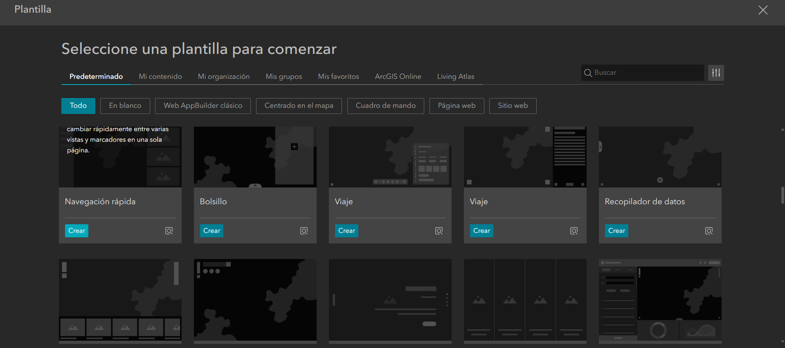
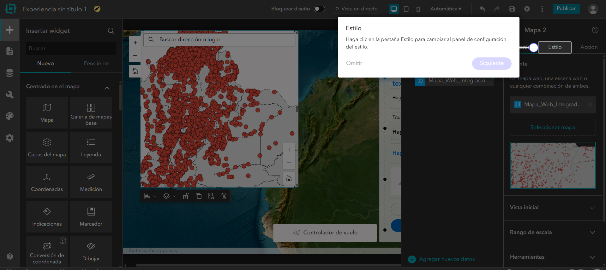
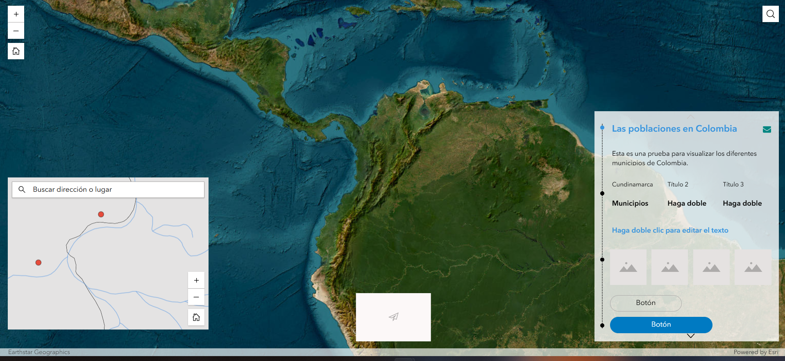

# Introducción

Este informe sintetiza el flujo de trabajo desarrollado para llevar información geográfica local desde ArcGIS Pro hacia ArcGIS Online. El ejercicio partió de una base de datos geográfica con capas vectoriales de Colombia y finalizó con la construcción de un mapa web integrado y una aplicación en ArcGIS Experience Builder. El proceso permitió articular tres componentes técnicos: preparación cartográfica en escritorio, publicación de servicios web y diseño de una interfaz de consulta para usuarios finales.

El trabajo se organizó a partir de una lógica de separación entre cartografía base y capa operativa. La cartografía base se estructuró como un servicio de teselas vectoriales, orientado a la visualización rápida y eficiente en entornos web. La capa de poblaciones se publicó como una capa de entidades alojada, con el fin de conservar capacidades de consulta, edición, exportación y despliegue dinámico de atributos. Esta distinción permitió construir un producto más ordenado: por un lado, una base cartográfica estable; por otro, una capa temática consultable y modificable.

# Objetivo del trabajo

El objetivo general fue implementar un flujo reproducible para publicar datos geográficos locales en ArcGIS Online y utilizarlos como insumo para la creación de un mapa web y una aplicación interactiva. El ejercicio buscó reconocer las diferencias entre los principales tipos de servicios web disponibles en la plataforma, configurar adecuadamente la simbología y los rangos de escala, y preparar una experiencia de visualización que facilitara la consulta de municipios o poblaciones de Colombia.

De manera específica, el trabajo permitió:

- configurar un proyecto local en ArcGIS Pro con mapas independientes para base cartográfica y capa operativa;
- definir el sistema de referencia del proyecto usando MAGNA-SIRGAS / Origen Nacional, EPSG:9377;
- publicar una capa de entidades alojada para las poblaciones de Colombia;
- publicar una capa de teselas vectoriales para el mapa base nacional;
- integrar ambos servicios en un mapa web dentro de ArcGIS Online;
- construir una aplicación web mediante Experience Builder a partir del mapa publicado.

# Preparación del proyecto en ArcGIS Pro

El primer momento del trabajo consistió en la organización del entorno local. Se creó una estructura de carpetas para separar datos, imágenes, documento Quarto y proyecto de ArcGIS Pro. Esta organización permitió mantener vinculados los archivos del proyecto y facilitó la posterior documentación del procedimiento.

La base de datos geográfica utilizada contenía capas vectoriales de Colombia, incluyendo departamentos, municipios, poblaciones y drenajes. A partir de estas capas se crearon dos mapas independientes dentro de ArcGIS Pro. El primero, denominado `Mapa_Base`, se destinó a la publicación de la cartografía de referencia. El segundo, denominado `Mapa_Operativo`, se utilizó para publicar la capa de poblaciones como servicio de entidades.

La separación entre ambos mapas respondió a una decisión técnica. Las capas de referencia, como departamentos y drenajes, no requerían edición frecuente y debían comportarse como contexto cartográfico. En cambio, la capa de poblaciones debía conservar capacidades de consulta y atributos asociados. Por esa razón se publicó como `Hosted Feature Layer`.

# Configuración cartográfica y sistema de referencia

El proyecto se configuró en MAGNA-SIRGAS / Origen Nacional, EPSG:9377. Esta referencia permitió trabajar con un sistema adecuado para Colombia durante la etapa local de preparación cartográfica. La selección del CRS local favorece la coherencia de las geometrías y evita depender exclusivamente de la reproyección automática que se aplica al publicar en servicios web.

En el `Mapa_Base` se incorporaron las capas de departamentos y drenajes. Los departamentos se simbolizaron con tonos neutros para funcionar como soporte visual sin competir con las capas operativas. Los drenajes se representaron con color azul claro y transparencia, y se configuró un rango de escala para evitar saturación visual a escalas nacionales.

La restricción de escala aplicada a los drenajes respondió a una consideración de legibilidad y rendimiento. Una red hídrica densa puede producir exceso de vértices, sobreposición de líneas y ruido gráfico cuando se observa el mapa a escalas pequeñas. Al limitar su visualización a escalas más detalladas, el mapa conserva mayor claridad y reduce la carga gráfica que debe enviarse al navegador.

# Publicación de servicios web

## Capa operativa: Hosted Feature Layer

La capa de poblaciones fue publicada desde `Mapa_Operativo` como una capa de entidades alojada. Este tipo de servicio mantiene la información vectorial como entidades consultables y permite trabajar con geometrías, tablas de atributos y ventanas emergentes. Su uso resultó adecuado porque las poblaciones funcionan como capa temática principal del ejercicio.

Durante la publicación se configuraron los metadatos mínimos del servicio: nombre, resumen, etiquetas y nivel de acceso. También se habilitaron capacidades operativas como sincronización, exportación de datos y servicios compatibles con estándares de interoperabilidad cuando correspondía. Estas opciones determinan qué puede hacer un usuario con la capa una vez publicada en ArcGIS Online.

## Cartografía base: Vector Tile Layer

El mapa base se publicó como capa de teselas vectoriales. Este formato divide la cartografía en paquetes vectoriales que se transfieren de manera eficiente al cliente web. A diferencia de una tesela ráster, la tesela vectorial no entrega una imagen fija sino geometrías y estilos que pueden adaptarse a distintas resoluciones de pantalla.

La elección de teselas vectoriales fue pertinente para una cartografía de referencia, porque permite una visualización más liviana, escalable y compatible con navegadores y dispositivos móviles. También facilita el ajuste de estilos sin necesidad de volver a procesar completamente los datos originales.

# Integración en ArcGIS Online

Una vez publicados los servicios, se verificó su disponibilidad en el contenido de ArcGIS Online. Luego se creó un mapa web integrando la capa de teselas vectoriales como mapa base y la capa de poblaciones como capa operativa. Esta integración permitió construir un producto cartográfico funcional dentro del ecosistema web de Esri.

El mapa web se configuró con ventanas emergentes y alias de campos. Esta etapa permitió transformar una capa técnica en una capa más legible para usuarios finales, ya que los nombres de campos internos fueron reemplazados por nombres de visualización más claros. También se revisó el nivel de uso compartido y la información del elemento, incluyendo descripción, etiquetas y términos de uso.

# Segundo momento: creación de una aplicación web en Experience Builder

El segundo momento del informe corresponde a la construcción de una aplicación web a partir del mapa publicado. Aunque el flujo general de ArcGIS Online ofrece varias rutas para convertir un mapa web en una aplicación —por ejemplo, Instant Apps, Dashboards, StoryMaps o Experience Builder— en este caso se optó por Experience Builder. Esta opción permitió diseñar una interfaz más flexible, con mayor control sobre la distribución de widgets, textos, paneles y componentes visuales.

## Selección de plantilla

El proceso inició con la selección de una plantilla dentro de Experience Builder. La interfaz presentó diferentes opciones predeterminadas, incluyendo plantillas centradas en el mapa, páginas web, sitios y cuadros de mando. Para este ejercicio se utilizó una plantilla que permitiera combinar un mapa principal con paneles laterales, texto descriptivo y elementos de navegación.

{#fig-menu width="100%"}

La selección de plantilla definió la estructura inicial de la aplicación. En esta etapa no se configuró todavía el contenido definitivo, sino el marco general de la experiencia: disposición de mapa, panel de información, elementos de navegación y zonas editables.

## Incorporación del mapa web

Después de crear la experiencia, se vinculó el mapa web previamente construido en ArcGIS Online. Este mapa contenía la base cartográfica publicada como teselas vectoriales y la capa operativa de poblaciones. Al incorporarlo en Experience Builder, el mapa dejó de ser únicamente un recurso cartográfico aislado y pasó a formar parte de una interfaz de consulta.

{#fig-creacion width="100%"}

En la configuración del widget de mapa se ajustó la vista inicial, el rango de escala y las herramientas disponibles para el usuario. También se revisó la relación entre el mapa y los demás widgets de la página. La aplicación debía permitir la exploración espacial de las poblaciones y, al mismo tiempo, ofrecer una explicación breve del contenido mostrado.

## Diseño de interfaz y elementos de consulta

La experiencia se estructuró con un mapa principal, un panel descriptivo y elementos visuales complementarios. El panel lateral incluyó un título, una descripción del propósito de la aplicación, campos de texto y botones configurables. La intención fue producir una interfaz básica, pero suficiente para demostrar cómo un mapa web puede ser transformado en un producto interactivo.

{#fig-app width="100%"}

El diseño mantuvo una lógica de lectura simple: el usuario observa el mapa, identifica la capa de poblaciones y consulta la información disponible desde los elementos emergentes o herramientas de navegación. El panel lateral funciona como guía contextual y permite presentar la aplicación como un producto terminado, no solo como una vista técnica del mapa.

# Análisis técnico

## Ventajas de las teselas vectoriales frente a teselas ráster

Las teselas vectoriales ofrecen ventajas mecánicas y de rendimiento frente a servicios tradicionales basados en imágenes. Al transferir geometrías y estilos en lugar de imágenes predibujadas, el volumen de datos puede reducirse y la representación se adapta mejor a pantallas con distintas resoluciones. Esto favorece la visualización en dispositivos móviles y navegadores, especialmente cuando la conexión tiene limitaciones de ancho de banda.

Otra ventaja es la flexibilidad simbólica. Una tesela ráster entrega una imagen ya renderizada; cualquier cambio de estilo requiere volver a generar el caché. En cambio, una capa de teselas vectoriales permite modificar estilos con mayor agilidad, ya que la representación visual se separa parcialmente de los datos. Esta propiedad resulta útil para mapas base que deben conservar buen rendimiento sin perder capacidad de personalización.

## Transformación de datos locales a Hosted Feature Layer

Cuando una capa local de una geodatabase se publica como `Hosted Feature Layer`, deja de depender del archivo local y pasa a almacenarse en la infraestructura cloud de ArcGIS Online. Las geometrías y atributos son convertidos en un servicio consultable mediante solicitudes web. El usuario ya no accede directamente al shapefile o a la geodatabase original, sino a una representación alojada que puede ser consumida por Map Viewer, Experience Builder, ArcGIS Pro u otras aplicaciones compatibles.

Durante esta transformación, la plataforma administra la persistencia de atributos, la indexación espacial, la consulta de entidades y la visualización web. Las proyecciones también entran en un flujo de interoperabilidad: los datos pueden estar preparados localmente en MAGNA-SIRGAS / Origen Nacional, pero su despliegue web suele ajustarse al esquema de visualización de ArcGIS Online, basado en Web Mercator para la integración con mapas base y clientes web.

## Justificación del rango de escala para drenajes

El rango de escala aplicado a los drenajes buscó controlar la densidad visual de la capa. En una escala nacional, una red hídrica detallada puede generar una representación saturada: demasiadas líneas, intersecciones, vértices y posibles conflictos con etiquetas o símbolos de otras capas. Esto afecta la lectura del mapa y también puede aumentar el volumen de información procesada por el cliente.

Al restringir la visibilidad de los drenajes a escalas más cercanas, la capa aparece cuando su información puede ser interpretada con mayor detalle. Esta decisión combina criterios cartográficos y criterios de rendimiento. El mapa no muestra todos los elementos en todos los niveles de zoom, sino solo aquellos que aportan información legible para la escala de observación.

## Interoperabilidad y sistemas de referencia

El flujo de trabajo combinó un sistema de referencia local para preparación de datos y un entorno web que opera bajo estándares de visualización global. MAGNA-SIRGAS / Origen Nacional es adecuado para mantener consistencia espacial en Colombia durante la etapa de edición y preparación. Web Mercator, por su parte, facilita la integración con servicios web, mapas base globales y aplicaciones de navegación en línea.

La interoperabilidad depende de que estos sistemas puedan dialogar mediante transformaciones controladas. Al publicar en ArcGIS Online, los datos se integran en una infraestructura que permite su consumo desde múltiples clientes. Esto amplía el alcance del producto cartográfico y evita que el resultado quede restringido a un proyecto local de escritorio.

# Conclusiones

El trabajo permitió pasar de un conjunto de capas locales en ArcGIS Pro a un producto web consultable y compartible en ArcGIS Online. La publicación diferenciada de servicios fue el eje técnico del ejercicio: la capa de poblaciones se mantuvo como servicio de entidades para conservar consulta y atributos, mientras que el mapa base se publicó como teselas vectoriales para mejorar el rendimiento de visualización.

La creación de la aplicación en Experience Builder añadió una capa de comunicación al producto cartográfico. El mapa web se convirtió en una interfaz más completa, con componentes textuales, estructura visual y herramientas de exploración. Este paso mostró que la publicación de datos no termina en el servicio web: requiere también pensar en la experiencia de usuario, la legibilidad de la información y la forma en que el contenido será consultado por terceros.

