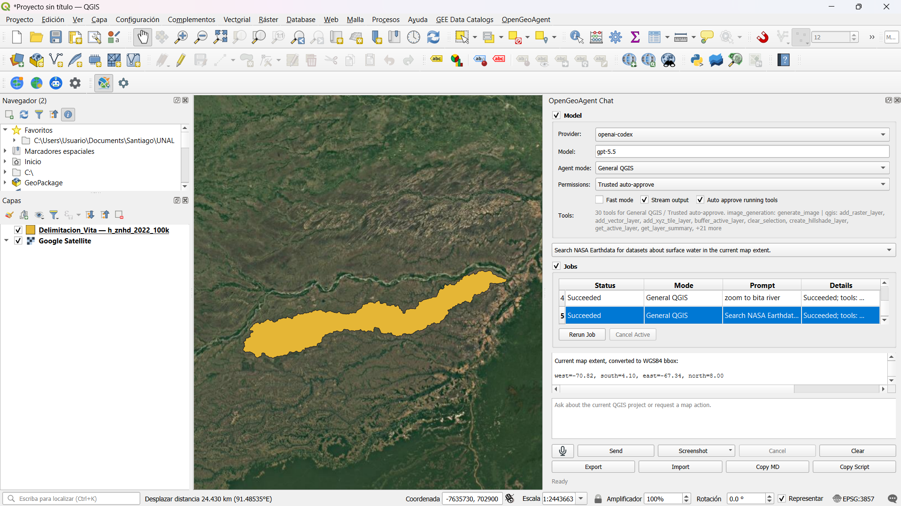
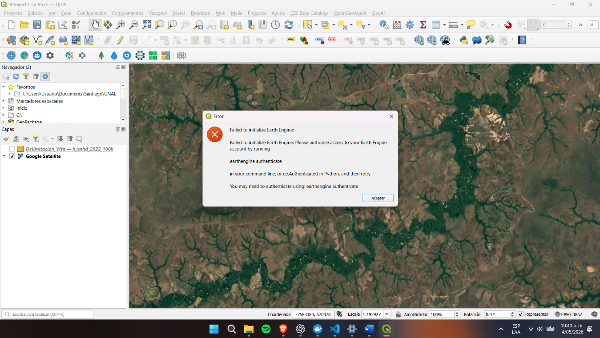
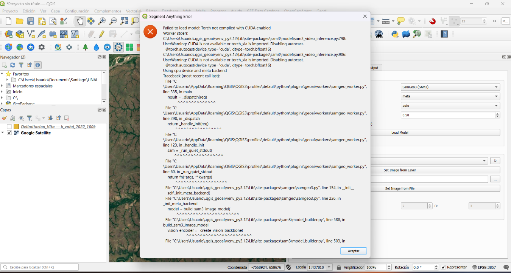

## a. Open Geo Agent

1. La configuración del plugin se llevó a cabo exitosamente. No obstante, la herramienta está mal optimizada para su ejecución en pantallas de menor tamaño, dado que no permite la opción de scroll para interactuar con el botón *test provider*. Sin embargo, se continuó sin seleccionar esta opción y la herramienta funcionó.

2. El prompt utilizado fue uno de los predeterminados: "Search NASA Earthdata for datasets about surface water in the current map extent."

3. Resultado:

> OpenGeoAgent I can't run a live NASA Earthdata/CMR web search from the current QGIS toolset, but I used the current map extent to prepare a search. Current map extent, converted to WGS84 bbox: west=-70.82, south=4.10, east=-67.34, north=8.00 Use this NASA CMR query: https://cmr.earthdata.nasa.gov/search/collections.json?keyword=surface%20water&bounding_box=-70.82,4.10,-67.34,8.00&page_size=20 Useful NASA Earthdata datasets to look for in this Bita River / Orinoco-region extent: OPERA Dynamic Surface Water Extent from HLS — DSWx-HLS Good for mapping open water from Harmonized Landsat/Sentinel-2. Search terms: OPERA DSWx-HLS surface water OPERA Dynamic Surface Water Extent from Sentinel-1 — DSWx-S1 Useful where clouds affect optical imagery. Search terms: OPERA DSWx-S1 water SWOT Level-2 River and Lake Products Best for river/lake water surface elevation and hydrology where available. Search terms: SWOT river lake water MODIS Water Mask / MOD44W Coarser but useful as background/global water reference. Search terms: MOD44W water mask MODIS Flood / Surface Water products Useful for broad-scale inundation or flood mapping. Search terms: MODIS flood water surface For Earthdata Search, use the same bounding box: -70.82, 4.10, -67.34, 8.00 Tool inputs: get_project_state Tools: get_project_state Elapsed: 38.00s

4. Screenshot1_opengeoanalyst

{width="100%"}

## b. GEE en QGIS

{width="100%"}

Screenshot1_gee

No fue posible inicializar la herramienta debido a problemas al autenticar. La autenticación tampoco fue posible debido a que Google bloquea el acceso a Google Cloud, por lo que la herramienta no puede obtener la llave de acceso al proyecto.

## c. GeoAI

{width="100%"}

Screenshot1_gee

La herramienta presentó errores en su inicialización.
